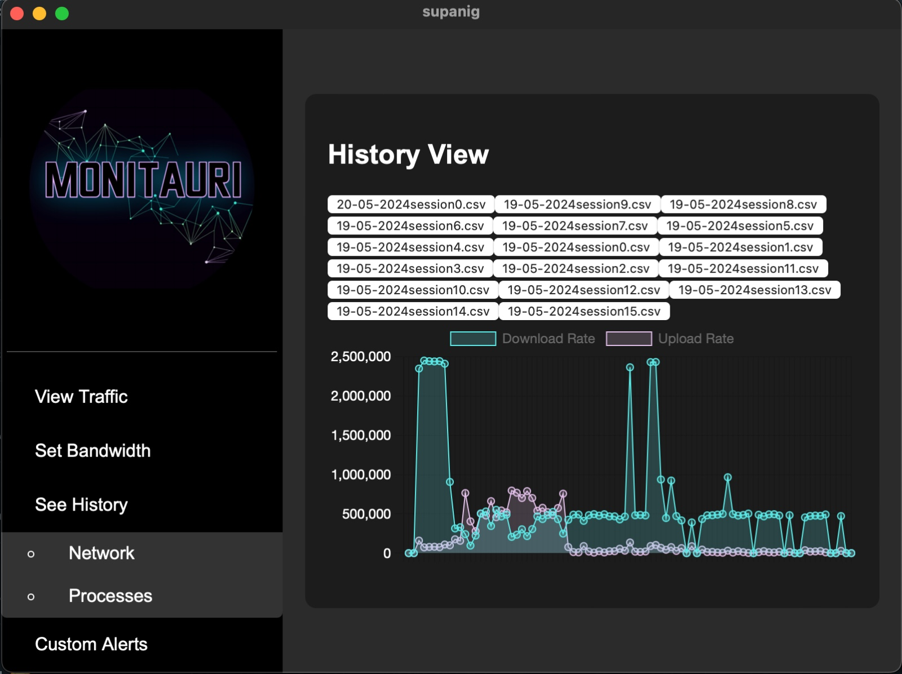
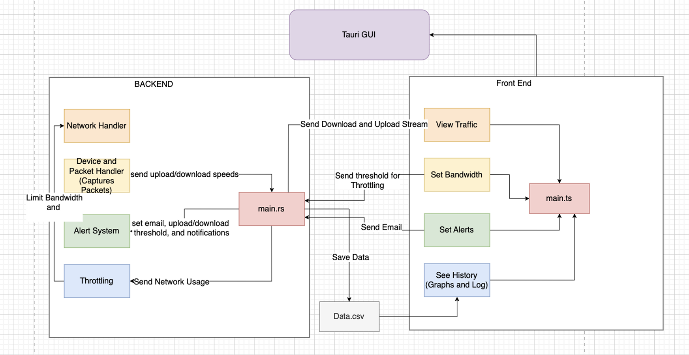

# 🌐 Monitauri Network Monitor 

A cross-platform, real-time **Linux & macOS** network monitoring tool built **from scratch** using **Rust** and **Tauri**, designed to be fast, user-friendly, and secure. Developed as part of an Operating Systems course gorup project at AUC. You can also find the paper posted in this repo if you want to learn more about our project :)

---

## 📸 Preview



---

## 🚀 Features

- **Real-time Network Monitoring**  
  Visualize upload/download rates and active connections.

- **Per-Process Traffic Tracking**  
  See which applications are using your network.

- **Bandwidth Limit Enforcement**  
  Set custom upload/download caps with system-level enforcement.

- **Email Notifications**  
  Get alerts when usage exceeds configured thresholds.

- **Historical Data Logging**  
  View and analyze past network activity.

- **GUI with Tauri**  
  Clean, intuitive frontend with live charts powered by Chart.js.

- **Multi-threaded Backend**  
  Highly efficient Rust backend optimized for concurrency.

---

## 🛠️ Tech Stack

| Layer        | Tech         |
|-------------|--------------|
| Frontend     | HTML, CSS, TypeScript, Chart.js |
| Backend      | Rust (with `pnet`, `pcap`, `lettre`, `ctrlc`) |
| GUI Framework | [Tauri](https://tauri.app) |
| Data Storage | CSV, .pcap |
| Visualization | Python (matplotlib, seaborn, pandas, Jupyter) |

---

## 📂 Architecture

- Packet capture & analysis via `pcap` and `pnet`
- Process tracking using `lsof`
- Multi-threaded Rust engine for performance
- Frontend/backend communication via Tauri APIs
- Persistent data storage for analytics
- GUI modules: Live traffic, History, Alerts



---

## 📈 Real-time Visuals

- Live line graphs of upload/download speed
- Pie charts showing data per source/process
- Dynamic time filters for history analysis

---

## 🛡️ Signal & Exception Handling

Gracefully handles `CTRL+C` and system signals using Rust’s `ctrlc` crate to ensure clean shutdown and data preservation.

---

## 📬 Email Notification

Configurable via GUI. Alerts are sent using `lettre` in Rust, when thresholds are exceeded. *(Note: Secure authentication support is WIP.)*

---

## ⚙️ Installation

> Prerequisites:  
> - Rust  
> - Tauri CLI  
> - Node.js & npm (for frontend)  
> - Python (for advanced stats, optional)

```bash
git clone https://github.com/yourusername/Monitauri
cd Monitauri
cargo tauri dev
```

To build a release version:

```bash
cargo tauri build
```

---

## 🧠 Lessons Learned

- Rust’s ownership model made multithreading safer but challenging at first.
- GUI/frontend-backend integration using Tauri was non-trivial but rewarding.
- Collaborating across modules required strong version control and coordination.

---

## 📌 Future Improvements

- Protocol-level analysis
- Enhanced error handling and security
- Expand to support Windows
- Improved authentication for email alerts

---

## 👥 Authors

- Ramy Badras  
- Layla Mohsen  
- Knzy Elmasry  
- Yuhan Shao  

Project for CSCE 3401 @ University of North Texas  
Instructor: Dr. Amr El-Kadi
